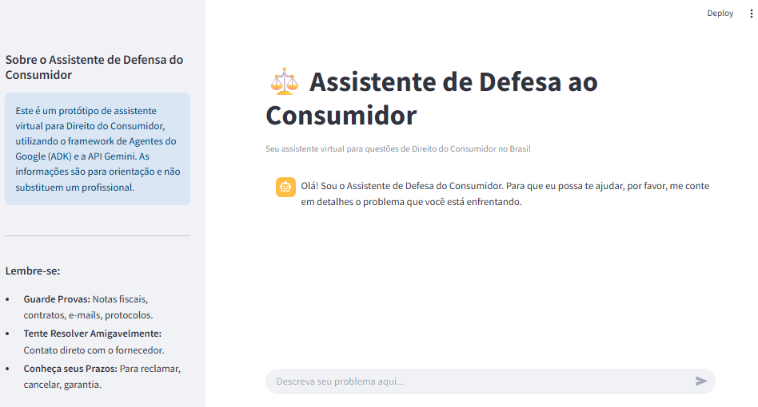
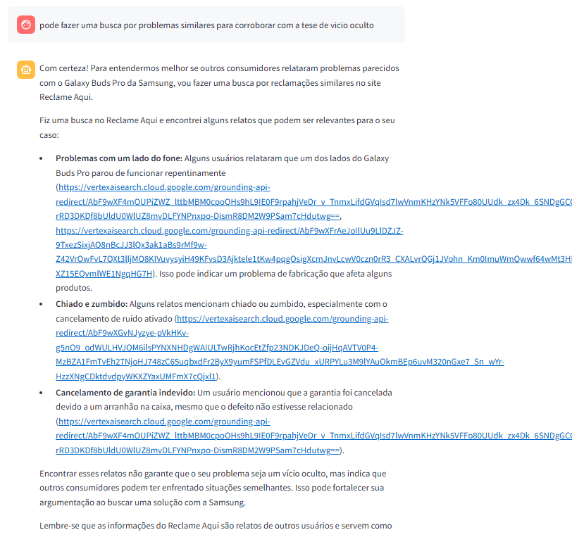

# Defensor do Consumidor AI 🛡️

**Seu advogado digital especializado em direitos do consumidor brasileiro**

## O Poder da IA a Serviço da Justiça Cotidiana

O Defensor do Consumidor AI transforma a experiência de resolver problemas de consumo, democratizando o acesso à justiça através de tecnologia de ponta. Desenvolvido com Python, Streamlit, Gemini e ADK da Agentes, nosso sistema não apenas orienta consumidores sobre seus direitos - ele **investiga ativamente** padrões de problemas para fortalecer sua defesa.

### Diferenciais Revolucionários:

✅ **Análise Inteligente de Reclamações Coletivas**: Identifica automaticamente padrões de problemas semelhantes no Reclame Aqui, transformando experiências individuais em evidências coletivas.

✅ **Orientação Jurídica Acessível**: Traduz o "juridiquês" em recomendações práticas e personalizadas, baseadas no CDC e legislação brasileira atualizada.

✅ **Geração de Documentos Estratégicos**: Prepara o consumidor com argumentos juridicamente relevantes para cada etapa da resolução.

✅ **Interface Humana e Empática**: Reconhece a frustração do consumidor e oferece suporte emocional durante todo o processo.

### Impacto Social:

O Defensor do Consumidor AI equilibra a balança entre empresas e consumidores, especialmente beneficiando aqueles sem acesso a assessoria jurídica tradicional. Ao identificar problemas recorrentes, contribui para um mercado mais transparente e responsável.

---

*"Transformando reclamações individuais em mudanças coletivas - porque seus direitos não deveriam exigir um advogado para serem respeitados."*

## Características do Assistente:

✅ A tecnologia avançada utilizada (Python, Streamlit, Gemini e ADK da Agentes)

✅ O recurso exclusivo de busca por reclamações similares no Reclame Aqui

✅ A capacidade de traduzir linguagem jurídica complexa em orientações acessíveis

✅ A abordagem empática para lidar com consumidores frustrados

## Para executar o Agente

É necessário a instalação do python 

https://www.python.org/downloads/


Instale os pacotes python necessários que estão no arquivo:

```
pip install -r requirements.txt
```

Adicione a chave API_KEY do google em um arquivo .env
```
GOOGLE_API_KEY="CHAVE"
```

1- É possível roda o arquivo backend_agent_consumer_defense.py diretamente e ter uma interação via terminal

2- Para rodar o chatbot local execute o comando
```
streamlit run app_frontent.py
```
O streamlit vai gerar uma url local com o chatbot criado, basta rodar esse endereço local no navegador

```
  You can now view your Streamlit app in your browser.

  Local URL: http://localhost:8502
  Network URL: http://192.168.0.39:8502
```


## Interface

Veja abaixo uma prévia da interface do assistente:







